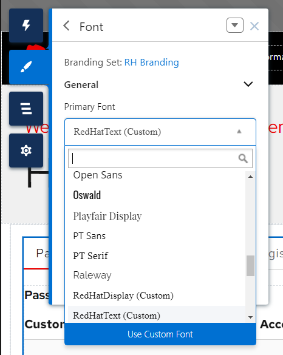
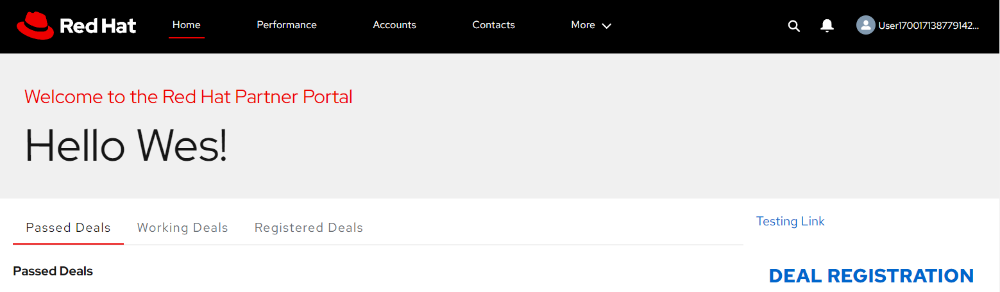

# Salesforce Experience Cloud Theming

This project helps you theme an Experience Cloud site with RH branding. Due to the point and click nature of Experience Cloud, a lot of the setup will be going through specific parts in the UI and updating settings.

This project contains a few custom code snippets which may not age well as updates to the theme, Experience Cloud, or Salesforce could effect how the code behaves. Any custom code should be well documented with the original intention so if it breaks or causes issues in the future, debugging will be a bit easier.

* [Setup](#setup)
  * [Pre-requisites](#pre-requisites)
  * [Global Settings](#global-settings)
  * [Navigation Theming](#navigation-theming)
  * [Hero Settings](#hero-settings)
* [Accessibility Guidance](#accessibility-guidance)
* [Deviating a bit from Salesforce Best Practices](#deviating-a-bit-from-salesforce-best-practices)
* [Contributing](#contributing)
* [Reporting Issues](#reporting-issues)

## Setup
### Pre-requisites
These settings are made for the **Aura framework**, using the **Jepson** Theme. It's possible that these settings and styles could be mapped to other types of Salesforce sites, but the custom CSS would likely need to be reworked for different class names.

All of these configuration and code updates are down in the UI in the "Builder" workspace on Experience cloud sites. 

### Global Settings

1. Set your site to the "Jepson Theme" if it isn't already. Press on the "Paint Brush" icon on the top left side (found in Builder mode) and press "Change Theme" 
2. In that same menu, select "Colors"
3. Set these colors to:
  * Text Color:         `rgb(21, 21, 21)`
  * Detail Text Color:  `rgb(106, 110, 115)`
  * Action Color:       `rgb(0, 102, 204)`
  * Link Color:         `rgb(0, 102, 204)`
  * Overlay Text Color: `rgb(255, 255, 255)`
  * Border Color:       `rgb(210, 210, 210)`
  * Page Background:    `rgb(255, 255, 255)`
4. Go back to the "Theme" menu, then go into "Images" 
5. Upload the Red Hat logo from this repo [`images/logo--on-dark.png`](images/logo--on-dark.png) to "General > Company Logo".
6. Go back to the "Theme" menu, select "Font"
7. For each dropdown, click  "Use Custom Font", which is at the bottom of the dropdown , and use the fonts below; note that fonts may look odd until we add the "head markup" later.
  * Primary Font: `Red Hat Text, Arial, sans-serif`
  * Header Fonts: `Red Hat Display, Arial, sans-serif`
  * Text Case should be left as `Unformatted`
8. In the "Theme" menu, select the arrow in the top right: 
9. Then select custom CSS, you may get a warning, this is expected.
10. Copy the contents of [`custom-css.css`](custom-css.css) into the text area and press "Save".
11. Next we'll press on the Gear icon, then "Advanced Settings". The gear is underneath the Brush that brought us to the "Theme" menu. 
12. Press "Edit Head Markup", then paste the contents of [`head-include.html`](head-include.html).
13. Press Save.

### Navigation Theming
To get the settings for the navigation, press on the **background** of the nav (not the logo, not on the links area). This should bring up the "Compact Header" settings.

Below are the values that should be changed, if it isn't listed it should be left alone. The desired values are viewable in the Markdown file, but are commented out.
1. Under "Backgrounds & Borders":
  * Color: `rgb(0, 0, 0)`
  <!--
  * Image: *No change*, `none`
  * Image Overlay Color: *No change*, `rgba(0, 0, 0, 0.3)`
  * Bottom Border Color: *No change*, `rgba(0, 0, 0, 0.5)`
  -->
2. Under "Links":
  * Link Color: `rgb(255, 255, 255)`
  * Link Hover Color: `rgb(255, 255, 255)`
  <!--
  * Link Active Border Color: *No change*, `Use Theme Color` (should appear blue)
  * Link Text Shadow Color: *No change*, `rgba(255, 255, 255, 0)` -->
3. Under "Dropdown Menus":
  <!--
  * Menu Text Color: *No change*, `Use Theme Color` (should appear black)
  -->
  * Menu Hover Color: `rgb(0, 102, 204)`
  * Menu Background Hover Color: `rgb(231, 241, 250)`
  * Menu Divider Color: `rgba(255, 255, 255, 0)`

### Hero Settings
Heroes do not _have to_ follow this exact pattern, this is a simple example that will be on brand and should work for all use cases.

If an graphics/photography are used, make sure it follows [the brand standards](https://www.redhat.com/en/about/brand/standards).

1. Click on the hero (the section that says "Your Dream Home" in the screenshot). 
2. Feel free to choose an appropriate "Hero Type" to suit your needs
3. Under "Background":
  * Color: `rgb(240, 240, 240)`
  * Image: Do not use the default image, a simple solution is to press `Clear` to get rid of the background image.
4. Under "Layout"
  * If you don't have an image:
    * Content Width: Probably want to set this to `100%`
      * Test different screen sizes by resizing your browser width between 420-1400px wide for any layout/readability issues. Larger sizes can be simulated by zooming the site out with `Ctrl` `-` or `Cmd` `-`.
    * Content Alignment: Should probably be set to `Left`
  * If an image is called for, the settings will depend on the image and content.
    * Make sure we have the rights to use the image:
      * Do not use random photos of the internet that don't have a clear license that allows our use.
      * See [Red Hat's Brand Standards for Photography](https://www.redhat.com/en/about/brand/standards/photography), which includes a lot of photos we can use.
      * See [Red Hat's Brand Standards for Illustrations](https://www.redhat.com/en/about/brand/standards/illustration), which includes graphics we can use.
      * Stock photos/graphics: make sure we have a license that supports our usage, sometimes the license is only for one use, so it can't be used on multiple sites, or we may have a license that's only good for a certain amount of time.
    * Play with different combinations of "Image Layout" and "Image Position" to get a satisfactory result
    * Test different screen sizes by resizing your browser width between 420-1400px wide for any layout/readability issues. Larger sizes can be simulated by zooming the site out with `Ctrl` `-` or `Cmd` `-`.
4. Under "Content":
  * Recommend having a caption and title text, which can look like this:  
  This is a common pattern in Red Hat sites to have accent text above the main title. If this works, follow these instructions:
    * Check "Show Caption Text"
    * Enter your text, in the example it's `Welcome to the Red Hat Partner Portal`
    * Caption Text Color: `rgb(238, 0, 0)`
    * Caption Text Shadow Color: `rgba(0, 0, 0, 0)`
    * Check "Title Text"
    * Enter your text, in the example it's `Hello {!CurrentUser.firstName}!`
    * Title Text Color: `rgb(21, 21, 21)`
    * Caption Text Shadow Color: `rgba(0, 0, 0, 0)`
    * Show Subtitle Text should be unchecked
      * If it makes more sense for the verbiage, the Caption text can be replaced with a subtitle, but it should be one or the other.
      * Subtitle Text Color: `rgb(100, 100, 109)`
    * Buttons
      * Text should be concise
      * Avoid opening in new tabs, this can be disorienting for users with disabilities
      * General button styles:
        * Button Border Radius: 3px
      * Primary/Only Button styles:
        * Button Text Color: Default should be white, if it isn't set it to: `rgb(255, 255, 255, 1)`
        * Button Text Hover Color: Default should be white, if it isn't set it to: `rgb(255, 255, 255, 1)`
        * Button Background Color: `rgb(238, 0, 0)`
        * Button Background Hover Color: `rgb(166, 0, 0)`
        * Button Border Color: `rgb(0, 0, 0)`
      * Secondary button styles
        * If there are 2 buttons they should be visually differentiated
        * Button Text Color: rgb(21, 21, 21)
        * Button Text Hover Color: `rgb(255, 255, 255)`
        * Button Background Color: `rgba(255, 255, 255, 0)`
        * Button Background Hover Color: `rgb(21, 21, 21)`
        * Button Border Color: `rgb(21, 21, 21)`

## Accessibility guidance
* Make sure the contrast between text and the background is sufficent, there are browser addons that can help test this, or you can use [WebAIM's Contrast Checker](https://webaim.org/resources/contrastchecker/).
* Avoid all caps, this is difficult to read for folks with dyslexia or reading issues.
* Custom CSS should take care of this, but font sizes should generally be 16px or above for readability. This helps with low vision, which can be a physical impairment, or a circumstance like the sun shining on a screen, washing it out.

## Deviating a bit from Salesforce Best Practices
There are a few instances where these styling coloring outside the lines of what Salesforce recommends. It's the original author's belief that we're doing so responsibly, and in a way that is very unlikely to cause problems.

However, that may not pan out. The custom css and head include code are well commented, here are a few areas worth calling out:
* @todo

## Contributing

?? @todo

## Reporting Issues

?? @todo